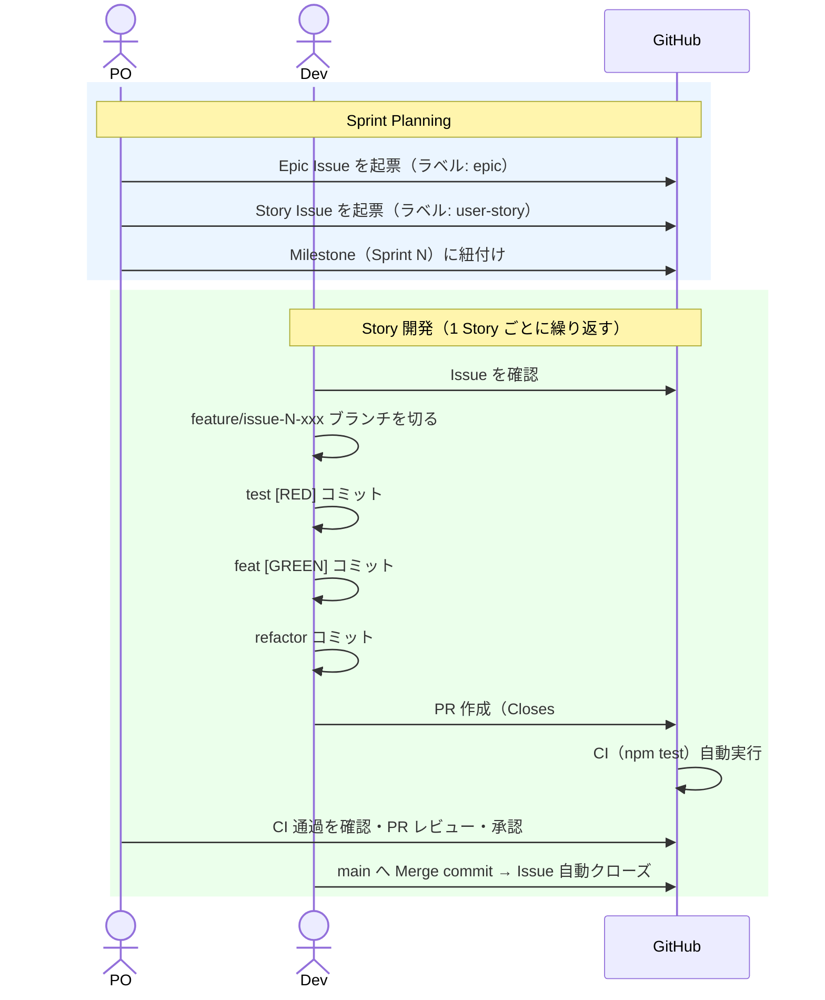
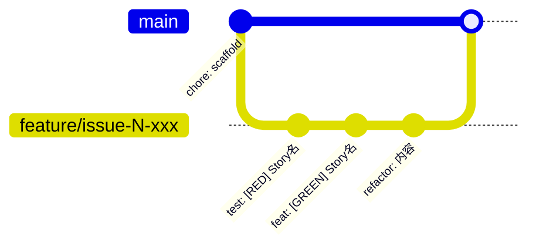

# 開発ワークフロー

スクラム開発（バックログ管理）と TDD を組み合わせた開発プロセス。本プロジェクト自体もこのワークフローに従って開発する。

## ロール

| ロール | 責任 |
|---|---|
| **PO**（Product Owner） | バックログの優先順位付け・受け入れ確認 |
| **Dev**（Developer） | 実装・テスト |

---

## スプリントの流れ



---

## ブランチとコミットの流れ



---

## コミットプレフィックス

| プレフィックス | 意味 |
|---|---|
| `test: [RED] <説明>` | 失敗するテストを追加 |
| `feat: [GREEN] <説明>` | テストを通す最小実装 |
| `refactor: <説明>` | 振る舞いを変えずに整理 |
| `chore: <説明>` | ビルド・設定など非機能的な変更 |
| `docs: <説明>` | ドキュメント |

## ブランチ名規則

```
feature/issue-{Issue番号}-{短い説明}
例: feature/issue-2-draw-grid
```

## バックログ構造

```
Epic（ラベル: epic）
  └── User Story（ラベル: user-story, Milestone: Sprint N）
        └── タスク（Story Issue 内のチェックリスト）
```
